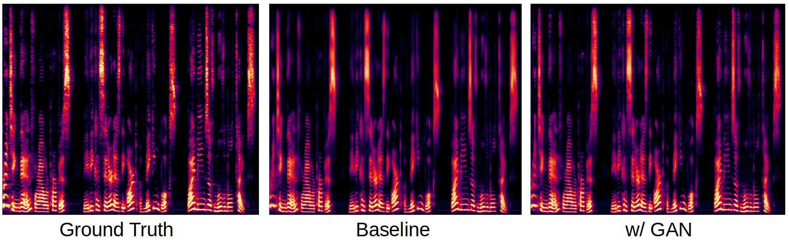

# AdvDCTTS (Adversarial Deep Convolutional TTS)


## Prerequisite
- python 3.7
- pytorch 1.3
- librosa, scipy, tqdm, tensorboardX

## Dataset
- [LJ Speech 1.1](https://keithito.com/LJ-Speech-Dataset/)


## Usage
1. Download the above dataset and modify the path in config.py. And then run the below command. 1st arg: signal prepro, 2nd arg: metadata (train/test split)
    ```
    python prepro.py 1 1
    ```

2. DCTTS has two models. Firstly, you should train the model Text2Mel. I think that 20k step is enough (for only an hour). But you should train the model more and more with decaying guided attention loss.
    ```
    python train.py text2mel <gpu_id>
    ```

3. Secondly, train the SSRN with GAN. The outputs of SSRN are many high resolution data. So training SSRN is slower than training Text2Mel
    ```
    python gan_train.py <gpu_id>
    ```

4. After training, you can synthesize some speech from text.
    ```
    python synthesize.py <gpu_id>
    ```

5. You can also test ssrn using the ground truth mel spectrograms.
    ```
    python test.py <gpu_id>
    ```



## Notes
- You can get more sharp spectrograms


## Other Codes
- [TensorFlow DCTTS](https://github.com/Kyubyong/dc_tts)
- [Pytorch DCTTS](https://github.com/Yangyangii/DeepConvolutionalTTS-pytorch)
